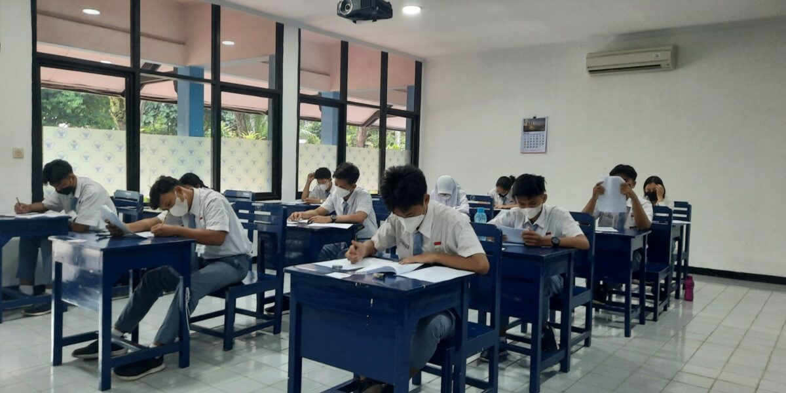

```{r setup, include=FALSE}
knitr::opts_chunk$set(echo = TRUE)
```



Prestasi siswa di Indonesia menunjukkan variasi yang signifikan di berbagai daerah, mencerminkan adanya perbedaan kondisi pendidikan, sosial-ekonomi, dan lingkungan. Hal ini dapat disebabkan oleh sejumlah faktor, seperti tingkat keterlibatan orang tua dalam proses belajar anak, kualitas pengajaran yang diberikan oleh guru, dan lingkungan belajar yang mendukung rasa aman dan nyaman bagi siswa. Faktor-faktor tersebut tidak hanya berdiri sendiri, tetapi sering kali saling berinteraksi, menciptakan dampak yang kompleks terhadap capaian prestasi siswa.

Pemahaman lebih dalam terhadap hubungan antara faktor-faktor ini dengan prestasi siswa menjadi sangat penting untuk mengidentifikasi elemen kunci yang berkontribusi secara signifikan. Misalnya, bagaimana tingkat partisipasi orang tua dalam pendidikan anak berpengaruh terhadap motivasi belajar siswa? Sejauh mana kualitas interaksi guru dengan siswa memengaruhi pemahaman materi pelajaran? Dan apakah lingkungan sekolah yang kondusif, seperti rendahnya tingkat kekerasan atau intimidasi, mampu meningkatkan performa akademik?

Melalui analisis berbasis daset rapor pendidikan tahun 2023, diambil dari website Portal Data milik Kemendikbudristek, penelitian ini bertujuan untuk mengukur pengaruh masing-masing faktor dan menentukan faktor mana yang paling dominan dalam memengaruhi prestasi siswa. Hasil dari analisis ini diharapkan tidak hanya memberikan wawasan bagi pemerintah untuk menyusun kebijakan pendidikan yang lebih efektif dan tepat sasaran, tetapi juga menjadi panduan bagi institusi pendidikan dalam meningkatkan kualitas layanan mereka. Dengan pendekatan berbasis bukti, strategi yang dirancang dapat membantu mengurangi kesenjangan prestasi antar daerah dan menciptakan sistem pendidikan yang lebih adil dan inklusif bagi seluruh siswa di Indonesia.

Hasil yang diharapkan yakni mengetahui seberapa besar hubungan antar variabel dan prediksinya sehingga kemudian dapat membentuk suat strategi/kebijakan yang membantu meningkatkan prestasi siswa Indonesia.

```{r}
# library
library(dplyr)
library(tidymodels)
library(ggplot2)
library(randomForest)
library(randomForestSRC)
library(corrplot)
library(shiny)
```

# Read Data

```{r}
# membaca data on kaggle
# data = read.csv("/kaggle/input/rapor-sma-2023/rapor-2023-peserta-didik-sma.csv")

data = read.csv("rapor-2023-peserta-didik-sma.csv")
```

## Data Understanding

```{r}
str(data)
```

Terdapat data (baris) dalam dataset sebanyak 41221 dengan banyak variabel (kolom) 137. Untuk penilitian ini, tidak semua variabel akan digunakan. Dengan penjelasan terhadap tujuan yang ingin dicapai, maka variabel yang akan dipilih untuk digunakan yakni:

Untuk Variabel Dependen, sebagai berikut:

**literasi**\
LIT (skor kemampuan literasi)\
LIT_INF (skor kompetansi membaca teks informasi)\
LIT_SAS (skor kompetensi membaca teks sastra)\
LIT_L1 (skor kompetensi mengakses dan menemukan isi teks)\
LIT_L2 (skor kompetensi menginterpretasi dan memahami isi teks)\
LIT_L3 (skor kompetensi mengevaluasi dan merefleksi isi teks)\

**numerasi**\
NUM (skor kemampuan numerasi)\
NUM_ALI (skor kompetensi pada domain aljabar)\
NUM_GEO (skor kompetensi pada domain geometri)\
NUM_BIL (skor kompetensi pada domain bilangan)\
NUM_DAT (skor kompetensi pada domain data dan ketidakpastian)

Untuk Variabel Independen, sebagai berikut:

**guru**\
AKC (skor panduan guru menurut siswa)\
ENP (skor penerapan praktik inovatif)\
PLIT (skor pembelajaran literasi)\
PMU (skor partisipasi murid)\
PNUM (skor pembelajaran numerasi)\
TAS (skor perhatian dan kepedulian guru menurut siswa)\
TSC (skor aktivitas interaktif menurut siswa)

**lingkungan sekolah**\
OCC (skor susana kelas yang mendukung pembelajaran menurut siswa)\
SAF (skor perasaan aman disekolah)\
WEL (skor perasaan nyaman di sekolah)

**orang tua dan ekonomi**\
POT (skor partisipasi orang tua)\
SES_siswa (index sosial ekonomi status siswa berdasarkan Asesmen Nasional)

Variabel dependen akan dibuat kedalam dua variabel saja yaitu skor literasi dan skor numerik. Skor literasi berisi rata-rata semua skor yang berhubungan dengan literasi, begitu pula skor numerik.

Variabel dependen kemudian akan dianalisis terhadap variabel independen untuk masing-masing kategori (guru, lingkungan sekolah, orang tua dan ekonomi).

# Data Preparation

## Memilih kolom yang akan digunakan

```{r}
data = data %>% select(LIT, LIT_INF, LIT_SAS, LIT_L1, LIT_L2, LIT_L3, NUM, NUM_ALJ, NUM_GEO, NUM_BIL, NUM_DAT, AKC, ENP, PLIT, PMU, PNUM, TAS, TSC, OCC, SAF, WEL, POT, SES_SISWA)

head(data)
```

## Handle NA atau N/A

Melakukan imputasi (rata-rata) ke data N/A atau NA

```{r}
data = data %>%
  mutate(across(
    where(is.numeric),  # Pilih hanya kolom numerik
    ~ ifelse(is.na(.), mean(., na.rm = TRUE), .) # Imputasi dengan mean
  ))

head(data)
```

## Feature Engineering

Menggabungkan skor numerik kedalam satu variabel, begitu pula dengan skor literasi.

```{r}
data = data %>% mutate(NUM_all = rowMeans(select(., NUM, NUM_ALJ, NUM_GEO, NUM_BIL, NUM_DAT))) %>% mutate(LIT_all = rowMeans(select(., LIT, LIT_INF, LIT_SAS, LIT_L1, LIT_L2, LIT_L3)))

#data = data %>% mutate(NUM_all = NUM + NUM_ALJ + NUM_GEO + NUM_BIL + NUM_DAT) %>% mutate(LIT_all = LIT + LIT_INF + LIT_SAS + LIT_L1 + LIT_L2 + LIT_L3)

data = data %>% select(-NUM, -NUM_ALJ, -NUM_GEO, -NUM_BIL, -NUM_DAT, -LIT, -LIT_INF, -LIT_SAS, -LIT_L1, -LIT_L2, -LIT_L3)

head(data)
```

## Analisis Korelasi

```{r}
cor_matrix = cor(data)
cor_matrix

corrplot(cor_matrix, method = "color", type = "full", 
         tl.col = "black", tl.srt = 45, 
         title = "Correlation Heatmap", 
         mar = c(0, 0, 2, 0))
```

Hubungan variabel dependen dengan independen tidak terlalu kuat, tapi cukup saling mempengaruhi satu sama lain. Walau begitu bukan berarti variabel independen sama sekali tidak mempengaruhi variabel dependen seperti AKC (skor panduan guru menurut siswa) yang paling berpengaruh diantara variabel independen lainnya.

## Analisis Nilai

### Numerasi

```{r}
ggplot(data, aes(
  x = NUM_all)) +
  geom_bar(fill = "lightblue", color = "black") +
  labs(
    title = "Nilai Numerasi Siswa",
    x = "Nilai",
    y = "Jumlah"
  ) +
  theme_minimal()
```

### Literasi

```{r}
ggplot(data, 
       aes(
  x = LIT_all)) +
  geom_bar(fill = "lightblue", color = "black") +
  labs(
    title = "Nilai Literasi Siswa",
    x = "Nilai",
    y = "Jumlah"
  ) +
  theme_minimal()
```

### Secara Keseluruhan

```{r}
ggplot(data, aes(x = "Numerasi", y = NUM_all)) +
  geom_boxplot(fill = "blue", alpha = 0.6) +
  geom_boxplot(aes(x = "Literasi", y = LIT_all), fill = "green", alpha = 0.6) +
  stat_summary(
    aes(x = "Numerasi", y = NUM_all),
    fun = mean, geom = "point", shape = 23, size = 3, fill = "red" #rata-rata
  ) +
  stat_summary(
    aes(x = "Literasi", y = LIT_all),
    fun = mean, geom = "point", shape = 23, size = 3, fill = "red"
  ) +
  labs(
    title = "Nilai Numerasi & Literasi",
    x = "Kategori",
    y = "Nilai"
  ) +
  theme_minimal()

```

# Modeling

## Data Splitting

```{r}
# Membagi data menjadi training dan testing (80% untuk training, 20% untuk testing)
set.seed(123)  # Menetapkan seed untuk replikasi
data_split = initial_split(data, prop = 0.8)

# Mengambil training set
train_data = training(data_split)

# Mengambil testing set
test_data = testing(data_split)
```

## Pemilihan Model

Penilitian ini menguji hubungan variabel dependen dengan variabel independen, maka dari itu dipilih model **Regresi**. Karena variabel dependen yang digunakan lebih dari satu, maka jenis regresi yang digunakan yaitu **Regresi Multivariat**.

```{r}
reg_multivariat_model = lm(cbind(NUM_all, LIT_all) ~ AKC + ENP + PLIT + PMU + PNUM + TAS + TSC + OCC + SAF + WEL + POT + SES_SISWA, data = train_data)
```

# Evaluasi Model

```{r}
predictions = predict(reg_multivariat_model, test_data)
head(predictions)
```

## MAE

```{r}
mae_num_rm = mean(abs(predictions[, 1] - test_data$NUM_all))
mae_lit_rm = mean(abs(predictions[, 2] - test_data$LIT_all))
```

## RMSE

```{r}
rmse_num_rm = sqrt(mean((predictions[,1] - test_data$NUM_all)^2))
rmse_lit_rm = sqrt(mean((predictions[,2] - test_data$LIT_all)^2))
```

## R-squared

```{r}
rsq_num_rm = 1 - sum((predictions[,1] - test_data$NUM_all)^2) / sum((test_data$NUM_all - mean(test_data$NUM_all))^2)

rsq_lit_rm = 1 - sum((predictions[,2] - test_data$LIT_all)^2) / sum((test_data$LIT_all - mean(test_data$LIT_all))^2)
```

## Data Evaluasi
```{r}
data_eval_rm = data.frame(
  Metric = c("LIT", "NUM"),
  RMSE = c(rmse_lit_rm, rmse_num_rm),
  RSQ = c(rsq_lit_rm, rsq_num_rm),
  MAE = c(mae_lit_rm, mae_num_rm)
)

data_eval_rm
```


## Perbandingan Aktual dan Prediksi

```{r}
actual_num = test_data$NUM_all
actual_lit = test_data$LIT_all

predictions_num = predictions[, 1]
predictions_lit = predictions[, 2]

comparison_data = data.frame(
  Actual_NUM_all = actual_num,
  Predicted_NUM_all = predictions_num,
  Actual_LIT_all = actual_lit,
  Predicted_LIT_all = predictions_lit
)

head(comparison_data)
```

### Visualisasi

```{r}
# Visualisasi NUM_all
ggplot(comparison_data, aes(x = Actual_NUM_all, y = Predicted_NUM_all)) +
  geom_point(color = 'blue') +
  geom_smooth(method = "lm", color = 'red') +
  labs(title = "Prediksi vs Aktual skor Numerasi", x = "Nilai Aktual skor Numerasi", y = "Nilai Prediksi skor Numerasi")

# Visualisasi LIT_all
ggplot(comparison_data, aes(x = Actual_LIT_all, y = Predicted_LIT_all)) +
  geom_point(color = 'green') +
  geom_smooth(method = "lm", color = 'orange') +
  labs(title = "Prediksi vs Aktual skor Literasi", x = "Nilai Aktual skor Literasi", y = "Nilai Prediksi skor Literasi")
```

## Kesimpulan Evaluasi Model

Model Regresi jenis Regresi Multivariant tidak cocok digunakan pada data yang dipakai. Meskipun model menunjukkan signifikansi statistik (p-value yang sangat kecil), nilai R-squared yang rendah menunjukkan bahwa hanya sebagian kecil dari variabilitas data yang dapat dijelaskan oleh model ini.

# Modeling 2

## Data Splitting

Menggunakan data splitting sebelumnya.

## Pemilihan Model

Variabel dependen dipisahkan menjadi dua (skor numerasi dan skor literasi). Digunakan model **Multivariat Random Forest** untuk **Regresi** karena menguji mengenai hubungan variabel dependen dengan variabel independen serta membuat prediksi.

```{r}
mrf_model = rfsrc(
  formula = cbind(LIT_all, NUM_all) ~ AKC + ENP + PLIT + PMU + PNUM + TAS + TSC + OCC + SAF + WEL + POT + SES_SISWA,
  data = train_data,
  mtry = floor(sqrt(ncol(train_data) - 1)),
  ntree = 300,
  importance = TRUE
)
```

# Evaluasi Model 2

```{r}
predictions_rf = predict(mrf_model, test_data)
head(predictions_rf)
```

```{r}
pred_LIT_all <- predictions_rf$regrOutput$LIT_all$predicted
pred_NUM_all <- predictions_rf$regrOutput$NUM_all$predicted
```

## MAE

```{r}
mae_num_mrf = mean(abs(pred_NUM_all - test_data$NUM_all))
mae_lit_mrf = mean(abs(pred_LIT_all - test_data$LIT_all))
```

## RMSE

```{r}
rmse_num_mrf = sqrt(mean((pred_NUM_all - test_data$NUM_all)^2))
rmse_lit_mrf = sqrt(mean((pred_LIT_all - test_data$LIT_all)^2))
```

## R-squared

```{r}
rsq_num_mrf = 1 - sum((pred_NUM_all - test_data$NUM_all)^2) / sum((test_data$NUM_all - mean(test_data$NUM_all))^2)

rsq_lit_mrf = 1 - sum((pred_LIT_all - test_data$LIT_all)^2) / sum((test_data$LIT_all - mean(test_data$LIT_all))^2)
```

## Data Evaluasi

```{r}
data_eval_mrf = data.frame(
  Metric = c("LIT", "NUM"),
  RMSE_mrf = c(rmse_lit_mrf, rmse_num_mrf),
  RSQ_mrf = c(rsq_lit_mrf, rsq_num_mrf),
  MAE_mrf = c(mae_lit_mrf, mae_num_mrf)
)

data_eval_mrf
```

### Membandingkan Evaluasi 2 Model

```{r}
eval_all = merge(data_eval_rm, data_eval_mrf, by = "Metric", all = TRUE)
eval_all = eval_all[, !grepl("^Row.names", colnames(eval_all))]

print(eval_all)
```

## Perbandingan Aktual dan Prediksi

```{r}
actual_num = test_data$NUM_all
actual_lit = test_data$LIT_all

comparison_data = data.frame(
  Actual_NUM_all = actual_num,
  Predicted_NUM_all_mrf = pred_NUM_all,
  Actual_LIT_all = actual_lit,
  Predicted_LIT_all_mrf = pred_LIT_all
)

head(comparison_data)
```

### Visualisasi

```{r}
# Visualisasi NUM_all
ggplot(comparison_data, aes(x = Actual_NUM_all, y = Predicted_NUM_all_mrf)) +
  geom_point(color = 'blue') +
  geom_smooth(method = "lm", color = 'red') +
  labs(title = "Prediksi vs Aktual skor Numerasi", x = "Nilai Aktual skor Numerasi", y = "Nilai Prediksi skor Numerasi")

# Visualisasi LIT_all
ggplot(comparison_data, aes(x = Actual_LIT_all, y = Predicted_LIT_all_mrf)) +
  geom_point(color = 'green') +
  geom_smooth(method = "lm", color = 'orange') +
  labs(title = "Prediksi vs Aktual skor Literasi", x = "Nilai Aktual skor Literasi", y = "Nilai Prediksi skor Literasi")
```

## Kesimpulan Evaluasi Model 2
Walau sedikit, model Multivariant Random Forest memiliki nilai lebih baik dalam melakukan pengujian pada dataset yang digunakan dibandingkan Multivariat Regression. Sehingga, diputuskan untuk menggunakan model ini untuk melakukan prediksi.

# Plot Model

## Numerasi

```{r}
plot(mrf_model, m.target="NUM_all")
```
Sama seperti pada analisis korelasi sebelumnya, AKC atau seberapa aktif guru dalam memandu siswa menjadi variabel independen yang penting dalam penentu nilai siswa dibidang numerasi, disusul oleh SES_SISWA atau bagaimana status sosial ekonomi siswa.

Untuk beberapa variabel independen lain yang juga bisa dikatakan mempengaruhi nilai numerasi siswa antara lain penerapan praktik inovatif (ENP) dan susana kelas yang mendukung pembelajaran (OCC).

## Literasi

```{r}
plot(mrf_model, m.target="LIT_all")
```
Untuk nilai literasi siswa, andil guru dalam membatu siswa menjadi faktor penting yang mempengaruhi tingkat literasi siswa.

# Kesimpulan EDA
Peran guru dalam membimbing dan memandu siswa dalam pembelajaran mempengaruhi hasil belajar siswa baik dibidang numerasi maupun literasinya. Oleh karenanya, diperlukan guru atau pendidik yang tekun dan teliti.

Kemampuan siswa dalam numerasi sedikit banyak juga dipengaruhi oleh status sosial ekonomi siswa, dimana kemungkinan siswa dengan status sosial ekonomi yang bagus paham pentingnya mengasah kemampuan numerasi sedini mungkin dan cenderung bisa dan/atau akan mengikuti les, baik baru saat mulai memasuki jenjang SMA/SMK/MA atau bahkan lebih dulu daripada itu. Hal lain yang dapat memengaruhi kemampuan numerasi siswa yaitu seberapa sering menerapkan praktik numerasi (pada pembelajaran) serta bagaimana suasana kelas saat pembelajaran dilangsungkan.


```{r}
# Load Data dan Model
dataset <- read.csv("rapor-2023-peserta-didik-sma.csv")

# Preprocessing dataset sama seperti sebelumnya
dataset <- dataset %>%
    select(LIT, LIT_INF, LIT_SAS, LIT_L1, LIT_L2, LIT_L3, NUM, NUM_ALJ, NUM_GEO, NUM_BIL, NUM_DAT,
           AKC, ENP, PLIT, PMU, PNUM, TAS, TSC, OCC, SAF, WEL, POT, SES_SISWA) %>%
    mutate(across(
        where(is.numeric),
        ~ ifelse(is.na(.), mean(., na.rm = TRUE), .)
    )) %>%
    mutate(
        NUM_all = rowMeans(select(., NUM, NUM_ALJ, NUM_GEO, NUM_BIL, NUM_DAT)),
        LIT_all = rowMeans(select(., LIT, LIT_INF, LIT_SAS, LIT_L1, LIT_L2, LIT_L3))
    ) %>%
    select(-NUM, -NUM_ALJ, -NUM_GEO, -NUM_BIL, -NUM_DAT, -LIT, -LIT_INF, -LIT_SAS, -LIT_L1, -LIT_L2, -LIT_L3)

# Load Model
mrf_model <- readRDS("mrf_model.rds")  # Pastikan model disimpan dalam format RDS

model = rfsrc(
  formula = cbind(LIT_all, NUM_all) ~ AKC + ENP + PLIT + PMU + PNUM + TAS + TSC + OCC + SAF + WEL + POT + SES_SISWA,
  data = train_data,
  mtry = floor(sqrt(ncol(train_data) - 1)),
  ntree = 300,
  importance = TRUE
)

# UI
ui <- fluidPage(
    titlePanel("Prediksi Skor Numerasi dan Literasi"),
    sidebarLayout(
        sidebarPanel(
            numericInput("akc", "AKC (Panduan Guru):", value = 50),
            numericInput("enp", "ENP (Praktik Inovatif):", value = 50),
            numericInput("plit", "PLIT (Pembelajaran Literasi):", value = 50),
            numericInput("pmu", "PMU (Partisipasi Murid):", value = 50),
            numericInput("pnum", "PNUM (Pembelajaran Numerasi):", value = 50),
            numericInput("tas", "TAS (Perhatian Guru):", value = 50),
            numericInput("tsc", "TSC (Aktivitas Interaktif):", value = 50),
            numericInput("occ", "OCC (Suasana Kelas):", value = 50),
            numericInput("saf", "SAF (Keamanan Sekolah):", value = 50),
            numericInput("wel", "WEL (Kenyamanan Sekolah):", value = 50),
            numericInput("pot", "POT (Partisipasi Orang Tua):", value = 50),
            numericInput("ses", "SES (Status Sosial Ekonomi):", value = 50),
            actionButton("predict", "Prediksi")
        ),
        mainPanel(
            textOutput("numerasi_result"),
            textOutput("literasi_result")
        )
    )
)

# Server
server <- function(input, output, session) {
    observeEvent(input$predict, {
        # Ambil data input dari pengguna
        input_data <- data.frame(
            AKC = input$akc,
            ENP = input$enp,
            PLIT = input$plit,
            PMU = input$pmu,
            PNUM = input$pnum,
            TAS = input$tas,
            TSC = input$tsc,
            OCC = input$occ,
            SAF = input$saf,
            WEL = input$wel,
            POT = input$pot,
            SES_SISWA = input$ses,
            wt = 0,
            hp = 0
        )
        
        # Lakukan prediksi
        prediction <- predict(model, input_data)
        
        pred_LIT <- prediction$regrOutput$LIT_all$predicted
        pred_NUM <- prediction$regrOutput$NUM_all$predicted
        
        # Periksa struktur output prediksi
        print("Struktur Output Prediksi:")
        print(str(prediction))
        
        # Pastikan akses elemen prediksi sesuai dengan struktur output
        output$numerasi_result <- renderText({
            paste("Hasil Prediksi Numerasi:", round(pred_NUM, 2))  # Sesuaikan indeks/kolom
        })
        output$literasi_result <- renderText({
            paste("Hasil Prediksi Literasi:", round(pred_LIT, 2))  # Sesuaikan indeks/kolom
        })
    })
}

# Run App
shinyApp(ui = ui, server = server)
```